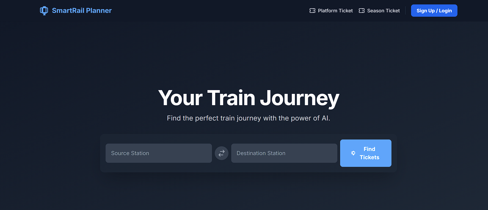

<div align="center">

</div>

# 🚂 SmartRail Planner

An intelligent railway ticket planning application powered by Google's Gemini AI. SmartRail Planner helps users find, compare, and book the best rail tickets with AI-driven recommendations and price analysis.

## ✨ Features

- **AI-Powered Ticket Search** — Uses Google Gemini AI to analyze and compare railway ticket options
- **Smart Recommendations** — Get personalized ticket suggestions based on your preferences
- **Real-time Pricing** — View current ticket prices and seasonal variations
- **Booking Management** — Track and manage your bookings with a clean, intuitive interface
- **Local Booking Support** — Save and manage local bookings for easy reference
- **Responsive Design** — Optimized for desktop and mobile devices using Tailwind CSS
- **Dark Mode** — Built-in dark mode support for comfortable viewing

## 🛠️ Tech Stack

- **Frontend:** React 19 with TypeScript
- **AI Integration:** Google Gemini AI API
- **Build Tool:** Vite
- **Styling:** Tailwind CSS
- **UI Components:** Custom React components
- **Icons:** SVG-based icon system

## 📋 Prerequisites

Before running the project, ensure you have:

- **Node.js** (v16 or higher)
- **npm** (v8 or higher)
- **Google Gemini API Key** (Get it from [Google AI Studio](https://ai.google.dev))

## 🚀 Getting Started

### 1. Clone the Repository

```bash
git clone https://github.com/Creating-Content/Smart_Rail_Planner.git
cd smartrail-planner
```

### 2. Install Dependencies

```bash
npm install
```

### 3. Configure Environment Variables

Create a `.env.local` file in the project root and add your Gemini API key:

```env
VITE_GEMINI_API_KEY=your_gemini_api_key_here
```

For reference, see [.env.example](.env.example).

### 4. Run Locally

Start the development server:

```bash
npm run dev
```

The app will be available at `http://localhost:5173`

## 📦 Available Scripts

- `npm run dev` — Start the development server with hot module replacement
- `npm run build` — Build the project for production
- `npm run preview` — Preview the production build locally

## 🌐 Deployment

### Deploy to Vercel

1. **Push to GitHub** — Ensure all changes are committed and pushed to your repository
2. **Connect to Vercel** — Visit [Vercel Dashboard](https://vercel.com) and import your GitHub repository
3. **Set Environment Variables** — In Vercel project settings, add:
   - **Name:** `VITE_GEMINI_API_KEY`
   - **Value:** Your Gemini API Key
4. **Deploy** — Vercel automatically builds and deploys on every push to `main`

### Environment Variables for Vercel

Make sure the following environment variable is set in your Vercel project:

```
VITE_GEMINI_API_KEY = your_api_key_here
```

## 📁 Project Structure

```
smartrail-planner/
├── components/          # Reusable React components
│   ├── Navbar.tsx       # Navigation bar
│   ├── TicketCard.tsx   # Ticket display component
│   ├── SuggestionCard.tsx
│   ├── LocalBookingModal.tsx
│   ├── Loader.tsx
│   └── icons.tsx        # SVG icon components
├── services/            # API and business logic
│   └── geminiService.ts # Gemini AI integration
├── types.ts             # TypeScript type definitions
├── App.tsx              # Main application component
├── index.tsx            # React entry point
├── index.html           # HTML template
├── vite.config.ts       # Vite configuration
├── tsconfig.json        # TypeScript configuration
├── package.json         # Project dependencies
└── README.md            # This file
```

## 🔐 Security Notes

- **Never commit** `.env.local` to version control
- The `.env.local` file is already listed in `.gitignore`
- Use `.env.example` as a template for environment variables
- Keep your Gemini API key confidential

## 🎨 UI/UX Highlights

- **Clean Design** — Minimalist and intuitive user interface
- **Smooth Animations** — Responsive interactions and transitions
- **Accessibility** — Semantic HTML and keyboard navigation support
- **Mobile Friendly** — Works seamlessly on all device sizes

## 🐛 Troubleshooting

### Blank Screen on Vercel
- Ensure `VITE_GEMINI_API_KEY` is set in Vercel environment variables
- Check that the build completes without errors: `npm run build`
- Clear Vercel cache and redeploy

### API Key Errors
- Verify your Gemini API key is valid and active
- Ensure the key is correctly set in `.env.local` (locally) or Vercel settings (production)
- Check API quota in [Google AI Studio](https://ai.google.dev)

### Build Failures
- Run `npm install` to ensure all dependencies are installed
- Check Node.js version: `node --version` (should be v16+)
- Clear node_modules and reinstall: `rm -rf node_modules && npm install`

## 📝 License

This project is licensed under the MIT License. See [LICENSE](LICENSE) for details.

## 👨‍💻 Author

Created by [Arkadip Ghosh](https://github.com/Creating-Content)

---

**Happy Rails! 🚂** Feel free to contribute and improve SmartRail Planner.
